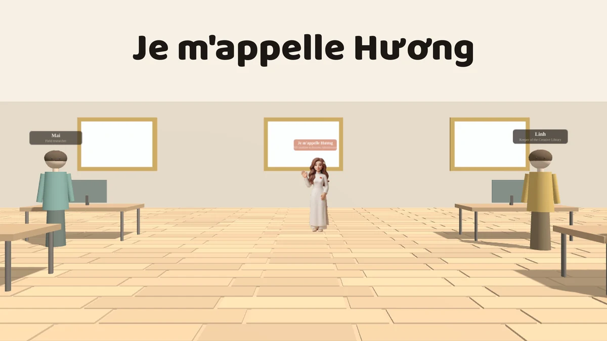

# Văn phòng nghiên cứu · Research Office

**Một căn phòng 3D chạy hẳn trong trình duyệt, không gọi mạng lần nào.** Khách
đi vào, gặp sáu nhân vật, và đọc xem luận án đang nghiên cứu điều gì. Mọi câu
trả lời đều do tác giả viết sẵn và nằm trong trang — **không có gì sinh ra lúc
chạy**.

▶ **[Mở văn phòng](https://thuyhuongctu.github.io/Research-Office/)**

[](https://doi.org/10.5281/zenodo.22971293)

<!-- ẢNH BÌA: assets/img/vanphong-bia.webp -->


---

## Trong phòng có gì

**Sáu nhân vật.** Đỗ Thùy Hương là người thật, và trả lời tám câu về luận án,
khung dữ liệu, các học phần đang dạy. Năm người còn lại — Mai, Linh, Tùng, An,
Minh — là **nhân vật hư cấu**, mượn từ cảnh «Trang viên tri thức» của trang học
thuật cá nhân; mỗi bảng hội thoại đều ghi rõ điều ấy. Họ trả lời về khung dữ
liệu WBES × WGI, danh mục công bố, các phần mềm học liệu, và chuyện trang này
không gọi mạng.

**Bảng thang phương thức thâm nhập**, trên tường phải, kèm quả địa cầu. Bảy bậc
xếp theo **mức cam kết nguồn lực tăng dần**, mỗi bậc neo vào một lý thuyết:

| Bậc | Đặc điểm | Lý thuyết neo |
| --- | --- | --- |
| Xuất khẩu | cam kết thấp, rút lui dễ | mô hình Uppsala |
| Cấp phép | cho dùng một quyền | chi phí giao dịch |
| Nhượng quyền | nhân rộng bằng vốn đối tác | lý thuyết đại diện |
| Liên doanh | chia rủi ro, mượn hiểu biết bản địa | khung CAGE |
| Liên minh chiến lược | trao đổi nguồn lực bổ sung | quan điểm dựa trên nguồn lực |
| Nền tảng số | sinh ra đã toàn cầu | born-global |
| Đầu tư trực tiếp | kiểm soát tối đa, thoái lui đắt | mô hình OLI (Dunning) |

Đây là **học liệu mở** cho học phần Kinh doanh quốc tế bậc đại học.

## Hai thứ tiếng

Việt và Anh, đổi bằng nút ở góc. Mặc định là **tiếng Anh** cho mọi khách; lựa
chọn của khách được nhớ lại và luôn thắng. Chữ đọc `lang` **ngay lúc vẽ**, nên
đổi ngôn ngữ giữa chừng thì bảng đang mở vẽ lại đúng.

## Không gọi mạng — đo, không phải hứa

| | |
| --- | --- |
| `<script src>` / `<link href>` trỏ ra ngoài kho | **0** |
| Lời gọi mạng lúc chạy | **0** |
| Yêu cầu ra ngoài sau khi nạp xong (đo bằng Chromium) | **0** |
| Mã phân tích lượt truy cập, quảng cáo, cookie bên thứ ba | **0** |

Không có máy chủ, không có bước dựng (build). Mở tệp `index.html` là chạy.

## Chạy thử tại chỗ

```bash
python3 -m http.server 8899     # rồi mở http://127.0.0.1:8899/
```

## Cách đi lại

| | |
| --- | --- |
| Đi | phím mũi tên hoặc `W A S D`; trên điện thoại thì dùng nút tròn |
| Nói chuyện | lại gần nhân vật rồi nhấn `E` |
| Đóng bảng | `Esc` |

---

## Nguồn gốc

Tác phẩm ra đời trong kho **[`thuyhuongctu/Je-mappelle-Huong`](https://github.com/thuyhuongctu/Je-mappelle-Huong)**
(trang học thuật cá nhân của tác giả), qua ba bản gộp trong ngày **26/09/2026**:

| Commit | PR | Nội dung |
| --- | --- | --- |
| `c3172a4` | #58 | Dựng trang từ đầu, thay cho một bản nháp do máy sinh |
| `ae3ad30` | #59 | Thêm góc Kinh doanh quốc tế và bảng thang phương thức |
| `33d7d49` | #60 | Thay năm nhân vật bằng năm người của trang viên |

Kho này là **bản chính thức để trích dẫn**; bản trên trang cá nhân
([`/vanphong.html`](https://thuyhuongctu.github.io/Je-mappelle-Huong/vanphong.html))
là bản trưng bày trong hệ sinh thái của trang.

## Giấy phép và trích dẫn

**Bản quyền © 2026 Đỗ Thùy Hương. Bảo lưu mọi quyền** — xem [`LICENSE`](LICENSE).
Công trình công bố để **đọc, tham khảo và trích dẫn**, không phát hành theo
giấy phép mở.

Thành phần bên thứ ba: **đúng hai mục**, three.js r128 (MIT) và hai bộ chữ
Baloo 2 + Be Vietnam Pro (OFL 1.1), cả hai dùng nguyên bản, kiểm kê đầy đủ ở
[`THIRD-PARTY.md`](THIRD-PARTY.md). Kho này **không lấy gì** từ kho `BizOn` —
kho ấy là tài sản đồng sở hữu.

Trích dẫn theo [`CITATION.cff`](CITATION.cff). DOI khái niệm —
**[10.5281/zenodo.22971293](https://doi.org/10.5281/zenodo.22971293)** — đại diện
mọi phiên bản và luôn dẫn tới bản mới nhất; đấy mới là DOI để trích dẫn. Riêng
bản `v1.0` có DOI [10.5281/zenodo.22971294](https://doi.org/10.5281/zenodo.22971294).

---

# Research Office (English)

**A small 3D research office that runs entirely in the browser and makes no
network request at all.** Walk in, meet six characters, and read what the
dissertation actually studies. Every answer is written in advance by the author
and stored in the page — **nothing is generated at run time**.

▶ **[Open the office](https://thuyhuongctu.github.io/Research-Office/)**

[](https://doi.org/10.5281/zenodo.22971293)

**Six characters.** Đỗ Thùy Hương is real, and answers eight questions about
the dissertation, the data frame and the courses she teaches. The other five —
Mai, Linh, Tùng, An, Minh — are **fictional characters** carried over from the
knowledge-estate scene of the author's academic homepage, and every dialogue
panel says so.

**A mode-of-entry board** on the right-hand wall sets out seven entry modes in
order of rising resource commitment — export, licensing, franchising, joint
venture, strategic alliance, digital platform, greenfield FDI — each anchored to
a standard International Business theory: the Uppsala model, transaction-cost
economics, agency theory, the CAGE framework, the resource-based view, the
born-global perspective, and Dunning's OLI paradigm. It is used as **open
teaching material** for an undergraduate International Business course.

**Bilingual** Vietnamese–English, English by default, the visitor's choice
remembered. **Zero network requests**, measured in Chromium, not promised. No
server, no build step, no analytics: opening `index.html` is enough.

Controls: arrow keys or `W A S D` to walk, `E` to talk, `Esc` to close a panel;
on a phone, the round buttons.

**Copyright © 2026 Đỗ Thùy Hương. All rights reserved** — see [`LICENSE`](LICENSE).
Published for reading and citation, not released under an open licence.
Third-party components: three.js r128 (MIT) and the Baloo 2 and Be Vietnam Pro
typefaces (OFL 1.1), both unmodified — see [`THIRD-PARTY.md`](THIRD-PARTY.md).
Please cite using [`CITATION.cff`](CITATION.cff), quoting the concept DOI
**[10.5281/zenodo.22971293](https://doi.org/10.5281/zenodo.22971293)**, which
represents every version and always resolves to the latest one.
